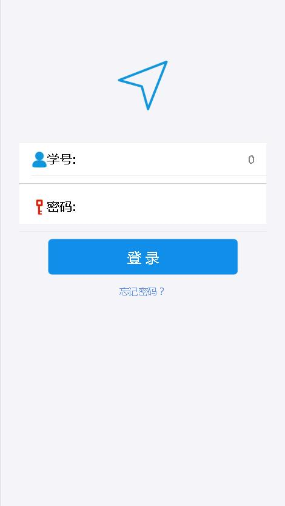
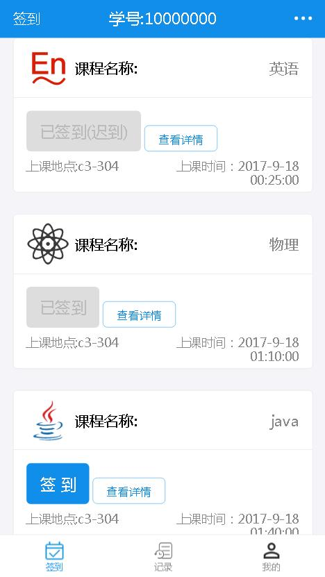

# 学生上课签到客户端(手机端)

## 技术栈
> 服务器端: `json-server`

> 客户端:`react+react-router+fetch+es6+redux+antd-mobile`

> 开发环境: 使用react 脚手架工具 `create-reate-app`进行项目搭建,使用`webpack`进行编译和打包

## 步骤 

> * `npm install` 安装项目依赖</br>
> * `npm run server` 启动`json-server`服务器，默认端口3000</br>
> * `npm start` 开始默认端口8888


## 项目说明
```
   该项目是对学生上课签到进行模拟
   全部采用的是RESTful规范的请求(get,post,put)
   每一个学生拥有的课程，每过一天会对签到状态进行重新赋值
   （数据库中signup表status:0表示可签到,1表示已签到,2表示迟到,3表示缺勤）
   登录系统后，系统会进行对该学生每一个课程可否签到进行判断以及进行是否缺勤的判断和记录
   课程详情模块会有该课程的详细信息和该课程今日所有学生的签到情况
   记录模块有当前该学生所有的历史签到记录
   我的模块有该学生的信息和修改密码和退出系统操作
```
## 路由配置
```html
  <Router history={hashHistory}>
      <Route path='/' component={Login}/>
      <Route path='/Main' component={Main}>
      <IndexRoute component={Sign}/>
      <Route path='Personal' component={Personal} />
      <Route path='HistoryLog' component={HistoryLog} />
      <Route path='Detail/:id' component={Detail} />
      </Route>
  </Router>
```

## 部分截图

> 登录界面



> 主界面



> 课程详情


> 记录模块


> 个人模块


